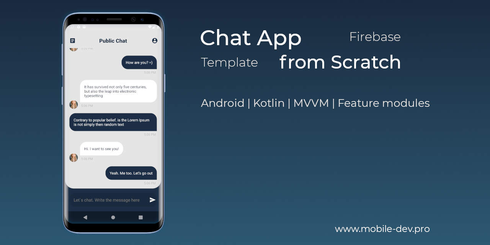

# Android App Template | Kotlin | MVVM + Clean Architecture | Dynamic Feature modules | Android 13 support

## Under the hood:
* [Clean Architecture with modularization (click to view a full scheme)](https://miro.com/app/board/uXjVOiQ2q3g=/?share_link_id=361857812650)
* [Kotlin](https://developer.android.com/kotlin)
* [ViewModel](https://developer.android.com/topic/libraries/architecture/viewmodel)
* [LiveData](https://developer.android.com/topic/libraries/architecture/livedata)
* [Data Binding](https://developer.android.com/topic/libraries/data-binding)
* [RxKotlin](https://github.com/ReactiveX/RxKotlin)
* [Koin](https://insert-koin.io/)
* [Navigation Components](https://developer.android.com/guide/navigation/)
* [Room](https://developer.android.com/topic/libraries/architecture/room)
* [Retrofit](https://square.github.io/retrofit/)
* [Material Components](https://github.com/material-components/material-components-android)
* [Firebase Crashlytics](https://firebase.google.com/docs/crashlytics)
* [Leak Canary](https://square.github.io/leakcanary/)
* [Circle CI | Continuous Integration](https://circleci.com/gh/mobile-dev-pro/AppTemplate)
* [My own Common-UI library (uses in production projects)](https://github.com/mobiledevpro/Android-Kotlin-MVVM-Template/tree/master/common-ui)  

## How to

* [Display content edge-to-edge | System insets](https://developer.android.com/develop/ui/views/layout/edge-to-edge)

##
## Author:

**Dmitri Chernysh**

## License:

Copyright 2020 Dmitri Chernysh

Licensed under the Apache License, Version 2.0 (the "License");
you may not use this file except in compliance with the License.
You may obtain a copy of the License at

       http://www.apache.org/licenses/LICENSE-2.0

Unless required by applicable law or agreed to in writing, software
distributed under the License is distributed on an "AS IS" BASIS,
WITHOUT WARRANTIES OR CONDITIONS OF ANY KIND, either express or implied.
See the License for the specific language governing permissions and
limitations under the License.

## Thanks for support !

**Stargazers**

**Forkers**

